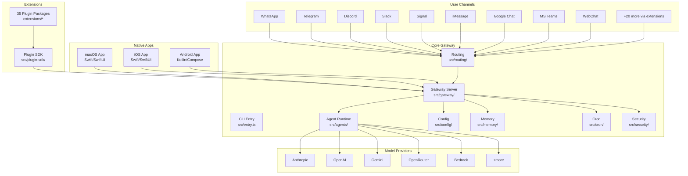
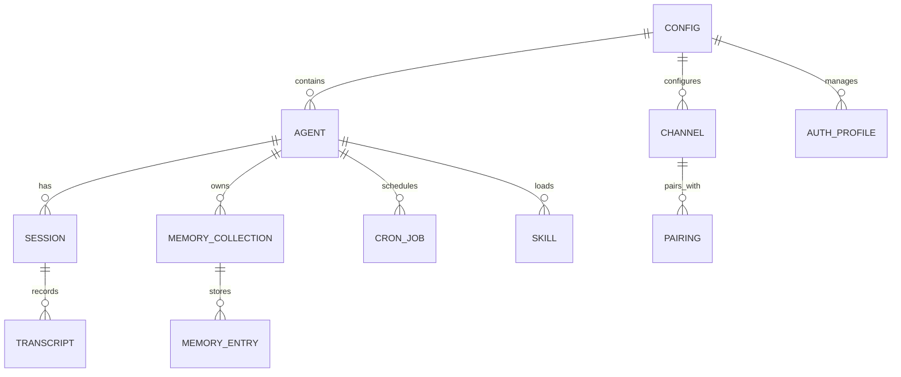

# 🔍 Repository Introspection Report

**Project:** OpenClaw
**Date:** 2026-02-16
**Analyst:** Senior Software Architect (automated introspection)
**Repository:** https://github.com/openclaw/openclaw

---

## PHASE 1: HIGH-LEVEL OVERVIEW

### 1.1 Identity & Purpose

- **Project name:** OpenClaw
- **Problem it solves:** OpenClaw is a personal, self-hosted AI assistant gateway. It routes AI conversations across multiple messaging channels (WhatsApp, Telegram, Slack, Discord, Signal, iMessage, Google Chat, Microsoft Teams, WebChat, and more) while providing a unified control plane. It supports voice, canvas rendering, memory, cron jobs, sub-agents, and a rich CLI.
- **Target audience:** Power users and developers who want a private, always-on AI assistant running on their own devices, accessible through any messaging platform they already use.
- **Maturity level:** **Production** — actively maintained with frequent releases (latest: 2026.2.16), comprehensive CI/CD, multi-platform native apps (macOS, iOS, Android), 50+ extensions, a plugin SDK, detailed documentation, and a growing contributor base.
- **README accuracy:** Yes. The README accurately describes the project, its capabilities, install instructions, quick-start guide, and links to comprehensive docs. It reflects the current state of the codebase well.

### 1.2 Tech Stack Summary

| Layer | Technology | Version | Notes |
| -------------- | -------------------------------- | ------------- | ------------------------------------------------------- |
| Language(s) | TypeScript (ESM, strict) | ~5.9.3 | Primary; also Swift (macOS/iOS), Kotlin (Android) |
| Runtime | Node.js | ≥22 | Bun also supported for dev/scripts |
| Framework(s) | Commander (CLI), Express (HTTP) | ^14.0.3 / ^5.2.1 | CLI + Gateway HTTP server |
| Database(s) | SQLite (via sqlite-vec) | 0.1.7-alpha.2 | Local vector DB for memory; file-based state |
| Cache/Queue | In-process queue | — | Croner for cron scheduling; no external queue |
| Frontend | Lit (Web Components) + Vite | ^3.3.2 | Control UI (WebChat); native apps for macOS/iOS/Android |
| Infrastructure | Fly.io, Render, Docker | — | Optional cloud deploy; primarily local/self-hosted |
| CI/CD | GitHub Actions | — | 10 workflow files; lint → test → build → release |
| Testing | Vitest + V8 coverage | ^4.0.18 | Unit, integration, E2E, live tests |
| Lint/Format | Oxlint + Oxfmt | ^1.47.0 / 0.32.0 | Type-aware linting; consistent formatting |
| Build | tsdown (Rolldown-based) | ^0.20.3 | Outputs to `dist/` |
| Package Manager | pnpm | — | Workspace monorepo; lockfile committed |
| Type Checker | TypeScript + tsgo (native preview) | 7.0.0-dev | `pnpm tsgo` for fast type checks |

### 1.3 Repository Statistics

| Metric | Value |
| ------------------------------------ | -------------- |
| Total files (excl. git/node_modules) | ~5,719 |
| TypeScript files | ~3,848 |
| TypeScript LOC (non-test source) | ~451,674 |
| TypeScript test files | ~1,146 |
| Swift files / LOC | ~486 / ~82,147 |
| Kotlin/KTS files | ~80 |
| Markdown documentation files | ~793 |
| JSON config files | ~116 |
| Direct dependencies | 52 |
| Dev dependencies | 21 |
| Extensions (plugins) | 35 |
| Last meaningful commit date | 2026-02-16 |

---

## PHASE 2: ARCHITECTURE ANALYSIS

### 2.1 Architectural Pattern

**Architecture:** **Modular Monolith with Plugin Architecture**

The project is a modular monolith organized as a pnpm workspace monorepo. The core TypeScript codebase (`src/`) is the CLI + gateway, with clearly separated concerns (agents, channels, config, gateway, routing, memory, providers, etc.). Extensions live in `extensions/*` as workspace packages, each with its own `package.json` and `openclaw.plugin.json` manifest. Native apps (macOS/iOS/Android) live under `apps/`.

The architecture is **intentional and well-structured**: the plugin SDK (`src/plugin-sdk/`) defines extension points, hooks provide lifecycle integration, and the gateway acts as a message bus connecting channels to agents and providers. The separation between core and extensions is deliberate and enforced.



### 2.2 Directory Structure Assessment

```
openclaw/
├── apps/                    # Native applications
│   ├── android/             # Android app (Kotlin + Compose)
│   ├── ios/                 # iOS app (Swift + SwiftUI)
│   ├── macos/               # macOS menubar app (Swift + SwiftUI)
│   └── shared/              # Shared native code (OpenClawKit)
├── assets/                  # Static assets, Chrome extension
├── docs/                    # Mintlify documentation site
│   ├── automation/          # Hooks, cron, webhooks
│   ├── channels/            # Per-channel setup docs
│   ├── cli/                 # CLI command references
│   ├── concepts/            # Architecture & concept docs
│   └── ...                  # ~793 markdown files
├── extensions/              # 35 plugin packages
│   ├── bluebubbles/         # iMessage via BlueBubbles
│   ├── discord/             # Discord channel plugin
│   ├── matrix/              # Matrix channel plugin
│   ├── memory-lancedb/      # LanceDB memory backend
│   ├── voice-call/          # Voice call integration
│   └── ...                  # 30 more plugins
├── packages/                # Internal workspace packages
│   ├── clawdbot/            # Bot package
│   └── moltbot/             # Bot package
├── scripts/                 # Build, release, and utility scripts
├── skills/                  # Agent skills definitions
├── src/                     # Core source code (~2,700 TS files)
│   ├── acp/                 # Agent Client Protocol
│   ├── agents/              # Agent runtime, tools, subagents
│   ├── browser/             # Browser automation (Playwright)
│   ├── channels/            # Channel abstraction layer
│   ├── cli/                 # CLI option wiring
│   ├── commands/            # CLI command implementations
│   ├── config/              # Config schema, I/O, validation
│   ├── gateway/             # Gateway server, WebSocket, auth
│   ├── infra/               # Infrastructure utilities
│   ├── media/               # Media pipeline (images, audio, video)
│   ├── memory/              # Memory/QMD system
│   ├── plugin-sdk/          # Extension SDK
│   ├── providers/           # Model provider integrations
│   ├── routing/             # Message routing
│   ├── security/            # Security auditing
│   ├── sessions/            # Session management
│   └── ...                  # 40+ subdirectories
├── test/                    # Test setup and shared helpers
├── ui/                      # Web UI (Lit + Vite)
├── vendor/                  # Vendored dependencies
├── Dockerfile               # Production Docker build
├── docker-compose.yml       # Docker Compose for local dev
├── package.json             # Root package manifest
├── pnpm-workspace.yaml      # Workspace configuration
├── tsconfig.json            # TypeScript configuration
├── vitest.config.ts         # Test configuration
└── tsdown.config.ts         # Build configuration
```

**Assessment:**
- ✅ Structure follows standard pnpm workspace monorepo conventions.
- ✅ Clear separation between core (`src/`), extensions, apps, UI, and docs.
- ✅ Plugin architecture with explicit manifests (`openclaw.plugin.json`).
- ⚠️ `src/` is very large (~2,700 TS files); some subdirectories (agents, gateway, config) are deep. This is a natural consequence of the project's scope but approaches the complexity ceiling for a monolith.
- ⚠️ Minor: several `*.e2e.test.ts` files are colocated with commands in `src/commands/`, which is fine for discoverability but leads to a large directory.

### 2.3 Entry Points & Flow

**Entry Points:**

1. **CLI Entry:** `src/entry.ts` → `openclaw.mjs` (shebang wrapper). The Commander-based CLI processes argv, handles env normalization, Node respawning for experimental warnings, and dispatches to command handlers.
2. **Gateway Server:** `src/gateway/server.ts` — Express + WebSocket server (default port 18789). Handles channel webhooks, agent requests, config API, and control UI.
3. **Channel Webhooks:** Each channel plugin registers webhook endpoints with the gateway (Telegram, Slack, Discord, etc.).
4. **Cron Jobs:** `src/cron/` — Croner-based scheduled task execution.
5. **Native Apps:** macOS/iOS/Android apps communicate with the gateway via WebSocket/HTTP.
6. **Plugin Hooks:** Extension lifecycle hooks (`llm_input`, `llm_output`, message events).

**Critical Path (Primary Use Case: Send a Message):**

```
User sends message on WhatsApp/Telegram/etc.
  → Channel webhook/polling receives message
    → src/routing/resolve-route.ts determines target agent
      → src/agents/ prepares context (memory, session, tools)
        → Provider API call (Anthropic/OpenAI/etc.)
          → Response streamed back through gateway
            → Channel-specific formatter sends reply
              → User receives response on their channel
```

### 2.4 Data Model

OpenClaw uses **file-based state** (no traditional database):

- **State directory:** `~/.openclaw/` (configurable via `OPENCLAW_STATE_DIR`)
- **Configuration:** `openclaw.json` (JSON5-compatible config file, validated by Zod schema)
- **Sessions:** JSONL transcript files under `~/.openclaw/agents/<agentId>/sessions/`
- **Memory:** SQLite + sqlite-vec for vector storage (QMD system)
- **Credentials:** `~/.openclaw/credentials/` (web provider OAuth tokens)
- **Channel state:** Per-channel state files



FACT: The data model is intentionally file-based and local-first, aligning with the "personal assistant on your own devices" philosophy. No external database is required.

---

## PHASE 3: CODE QUALITY DEEP DIVE

### 3.1 Code Style & Consistency

- **Linter:** Oxlint (type-aware, `pnpm lint`) with strict rules — `typescript/no-explicit-any: error`, correctness/perf/suspicious categories all set to error.
- **Formatter:** Oxfmt (`pnpm format:check`) with import sorting and package.json sorting enabled.
- **Pre-commit hooks:** Configured via `prek install` (runs same checks as CI).
- **Style consistency:** ✅ **Very consistent** across the codebase. ESM imports, strict TypeScript, consistent naming conventions, and enforced formatting.
- **Style violations:** Minimal. The linter/formatter enforce consistency automatically. Extensions directory is excluded from linting (intentional; extensions have their own conventions).

### 3.2 Complexity Analysis

**TOP 10 Most Complex Files (by LOC / estimated cyclomatic complexity):**

| Rank | File | LOC | Concern |
| ---- | -------------------------------------------------- | ---- | ------------------------------- |
| 1 | `src/discord/monitor/agent-components.ts` | 1,577 | Discord CV2 component rendering |
| 2 | `src/memory/qmd-manager.ts` | 1,238 | Memory/QMD lifecycle management |
| 3 | `src/agents/pi-embedded-runner/run/attempt.ts` | 1,203 | Agent run attempt orchestration |
| 4 | `src/config/io.ts` | 1,133 | Config I/O and persistence |
| 5 | `src/discord/components.ts` | 1,120 | Discord component builders |
| 6 | `src/agents/bash-tools.exec.ts` | 1,101 | Shell execution tool |
| 7 | `src/memory/manager-sync-ops.ts` | 1,077 | Memory sync operations |
| 8 | `src/telegram/send.ts` | 1,066 | Telegram message sending |
| 9 | `src/infra/state-migrations.ts` | 1,023 | State migration logic |
| 10 | `src/config/zod-schema.providers-core.ts` | 1,011 | Provider config Zod schemas |

**Assessment:**
- ⚠️ 14 files exceed the project's own ~500 LOC guideline (AGENTS.md recommends ≤500; hard cap ~700).
- ⚠️ Files like `agent-components.ts` (1,577 LOC) and `qmd-manager.ts` (1,238 LOC) are candidates for splitting.
- The Swift side also has large files: `GatewayModels.swift` (2,853 LOC each in two locations — generated protocol models).
- **Overall complexity rating: Medium** — Most files are well-sized; the outliers are identified and typically correspond to complex domain surfaces (Discord rendering, agent orchestration).

### 3.3 Error Handling

- **Pattern:** Primarily `try/catch` blocks (~894 source files use `try {`). Errors are caught, logged via the subsystem logger (`tslog`-based), and propagated or handled gracefully.
- **Consistency:** ✅ Good. The codebase uses `createSubsystemLogger()` consistently for structured logging with named subsystems.
- **Error logging:** Errors are logged to both console (filtered by subsystem) and file logs (`~/.openclaw/logs/`). Sensitive data is redacted from error output.
- **Global error handler:** Yes — `src/infra/warning-filter.ts` filters process warnings; the entry point sets up unhandled rejection handlers. The gateway has middleware-level error handling.
- **Error propagation:** Errors bubble up through the call stack with contextual information. Channel-specific errors are isolated to prevent one channel from affecting others.

### 3.4 Naming & Readability

- **Naming conventions:** ✅ Consistent kebab-case file names, camelCase variables/functions, PascalCase types/classes. Files are named descriptively (e.g., `auth-rate-limit.ts`, `resolve-route.ts`, `chat-sanitize.ts`).
- **Self-documenting:** The code is largely self-documenting through descriptive naming. Comments are used sparingly for tricky logic, as recommended in the project guidelines.
- **Readability score: 8/10** — Clean TypeScript with strict typing, consistent conventions, meaningful names. The modular structure makes navigation straightforward. Some complex agent orchestration files could benefit from more inline documentation.

### 3.5 Code Smells & Anti-Patterns

- [ ] **Dead code / unused imports** — Minimal. Oxlint catches unused imports.
- [ ] **Copy-paste duplication** — ⚠️ Some duplication in channel implementations (Telegram/Discord/Slack share similar patterns). Mitigated by shared abstractions in `src/channels/` and `extensions/shared/`.
- [ ] **Magic numbers / hardcoded values** — ⚠️ Some timeout values and port numbers are hardcoded (e.g., default port 18789). Most configurable values are properly externalized.
- [ ] **Tight coupling** — ✅ Low. Plugin SDK provides clean abstraction; channels are loosely coupled via the routing layer.
- [ ] **Missing abstraction layers** — ✅ Well-abstracted. Plugin SDK, channel abstraction, provider abstraction are all present.
- [ ] **Premature optimization** — ✅ Not observed.
- [ ] **Over-engineering** — ⚠️ Minor: the config system is quite complex (Zod schema + JSON5 + env vars + config patching + migration), but this complexity is justified by the use case.
- [ ] **Inconsistent abstraction levels** — ✅ Generally consistent.
- [ ] **Feature envy** — ✅ Not observed.
- [ ] **Shotgun surgery patterns** — ⚠️ Adding a new channel requires touching multiple files (routing, config schema, CLI, docs, labeler.yml). This is documented in AGENTS.md and mitigated by checklists.

---

## PHASE 4: DEPENDENCY & SECURITY ANALYSIS

### 4.1 Dependency Health

**Key Direct Dependencies:**

| Dependency | Purpose | Status |
| ------------------------------ | -------------------------------- | --------- |
| `commander` | CLI framework | ✅ Current |
| `express` | HTTP server (v5) | ✅ Current |
| `grammy` | Telegram bot framework | ✅ Current |
| `@slack/bolt` | Slack integration | ✅ Current |
| `@buape/carbon` | Discord framework | ⚠️ Pinned (do not update per policy) |
| `@whiskeysockets/baileys` | WhatsApp Web API | ⚠️ RC version (7.0.0-rc.9) |
| `sharp` | Image processing | ✅ Current |
| `playwright-core` | Browser automation | ✅ Current (1.58.2) |
| `@sinclair/typebox` | Runtime type validation | ✅ Current |
| `zod` | Schema validation | ✅ Current (v4) |
| `@mariozechner/pi-*` | Pi agent core/AI/TUI | ✅ Active |
| `sqlite-vec` | Vector database | ⚠️ Alpha (0.1.7-alpha.2) |
| `undici` | HTTP client | ✅ Current |
| `ws` | WebSocket | ✅ Current |
| `tslog` | Logging | ✅ Current |

**Dependency freshness:** ✅ Most dependencies are current or near-current. The project uses `^` ranges for flexibility while pinning critical packages (Carbon, Baileys).

**Lockfile:** ✅ `pnpm-lock.yaml` is committed and used with `--frozen-lockfile` in CI.

**Patched dependencies:** `patches/` directory exists for `pnpm.patchedDependencies`; pinned exact versions are required per project policy.

### 4.2 Security Assessment

- [x] **Secrets/credentials in code:** ✅ No secrets in source. `.env.example` uses placeholder values. `.detect-secrets.cfg` and `.secrets.baseline` for secret scanning.
- [x] **SQL injection vectors:** ✅ Low risk — SQLite usage is through sqlite-vec with parameterized queries.
- [ ] **XSS vulnerabilities:** ⚠️ Possible in WebChat UI (Lit components render user content). Needs review of sanitization in `src/webchat/` and `ui/`.
- [x] **CSRF vulnerabilities:** ✅ Gateway uses token-based auth; no cookie-based session management for API.
- [x] **Insecure deserialization:** ✅ JSON parsing uses standard `JSON.parse`; Zod validation on config input.
- [x] **Input validation:** ✅ Zod schemas validate config; channel inputs are validated per-channel.
- [x] **Authentication/authorization:** ✅ Gateway auth via token/password; device pairing with QR codes; operator scopes (`operator.admin`). Security audit CLI command available (`openclaw security audit`).
- [x] **Cryptographic practices:** ✅ SHA-256 for sandbox hashing (recently upgraded from SHA-1). Session files created with `0o600` permissions.
- [x] **Debug endpoints:** ✅ Debug settings are gated; status responses redact sensitive data for non-admin clients.
- [ ] **Rate limiting:** ⚠️ Auth rate limiting exists (`src/gateway/auth-rate-limit.ts`), but general API rate limiting status is unclear.
- [x] **CORS:** ✅ Gateway handles CORS for control UI; no broad wildcard observed.
- [x] **Sandbox security:** ✅ Docker sandbox blocks dangerous config (host networking, bind mounts, unconfined seccomp/apparmor).

### 4.3 Configuration Management

- **Method:** Multi-layered configuration: `openclaw.json` (JSON5) + `.env` files + environment variables + CLI flags.
- **Precedence:** Process env > `./.env` > `~/.openclaw/.env` > `openclaw.json` env block.
- **Environment separation:** Configuration is local-first; deployment configs exist for Docker, Fly.io, and Render.
- **Secure defaults:** ✅ Gateway binds to loopback by default; tokens required for LAN/public access; file permissions are restrictive.

---

## PHASE 5: TESTING & QUALITY ASSURANCE

### 5.1 Test Coverage Assessment

| Test Type | Count | Notes |
| ---------- | ----- | ------------------------------------------------------ |
| Unit tests | ~1,007 | Colocated `*.test.ts` in `src/` |
| Extension tests | ~106 | Colocated in `extensions/` |
| E2E tests | ~339 | `*.e2e.test.ts` files |
| Live tests | ~10 | `*.live.test.ts` (require real API keys) |
| Shared test helpers | ~4 | `test/` directory |

**Coverage thresholds (enforced in CI):**
- Lines: 70%
- Functions: 70%
- Branches: 55%
- Statements: 70%

**Coverage scope:** Only `src/**/*.ts` (core), excluding extensions, apps, UI, CLI wiring, and integration surfaces.

**Assessment:** Tests are meaningful, not boilerplate. They test real behavior with detailed assertions. The coverage thresholds are reasonable for a project of this type. E2E tests cover critical paths (agent execution, gateway communication, config operations).

### 5.2 Test Quality

- **Pattern:** Tests follow AAA (Arrange-Act-Assert) with Vitest's `describe`/`it`/`expect` API.
- **Fixtures:** ✅ Test helpers exist in `src/test-helpers/`, `src/test-utils/`, and `extensions/shared/`. `test/setup.ts` provides global test setup.
- **Isolation:** ✅ `unstubEnvs: true` and `unstubGlobals: true` prevent cross-test pollution. Fork pool (`pool: "forks"`) for process isolation.
- **Edge cases:** ✅ Many test files cover edge cases (e.g., `config.dm-policy-alias.test.ts`, `auth-rate-limit.test.ts`, `chat-sanitize.test.ts`).
- **Timeouts:** Test timeout is 120s (180s on Windows), reflecting the complexity of some integration tests.

### 5.3 CI/CD Pipeline

**Tool:** GitHub Actions (10 workflow files)

**Stages:**
1. **Docs scope detection** — Skip heavy jobs for docs-only changes.
2. **Changed scope detection** — Skip unrelated native (macOS/Android) builds on PRs.
3. **Lint & Format** — `pnpm check` (Oxfmt + tsgo + Oxlint).
4. **Test** — `pnpm test` with coverage on Ubuntu, macOS, and Windows.
5. **Build** — `pnpm build` verification.
6. **Native builds** — macOS (Swift), Android (Gradle) when relevant.
7. **Install smoke** — `pnpm test:install:smoke` for install verification.
8. **Docker release** — `docker-release.yml` for container publishing.
9. **Formal conformance** — `formal-conformance.yml` for spec compliance.
10. **Stale issue management** — `stale.yml`.

**Quality gates:**
- ✅ Coverage thresholds enforced (70% lines/functions/statements, 55% branches).
- ✅ Type checking (`pnpm tsgo`).
- ✅ Lint and format checks.
- ✅ Secret scanning (`.detect-secrets.cfg`).
- ✅ Concurrency control (`cancel-in-progress` for PRs).

---

## PHASE 6: DOCUMENTATION & DEVELOPER EXPERIENCE

### 6.1 Documentation Inventory

- [x] **README with setup instructions** — Comprehensive README with install, quick-start, upgrade, and development instructions.
- [x] **API documentation** — Gateway protocol documented; CLI commands documented in `docs/cli/`.
- [ ] **Architecture Decision Records (ADRs)** — Not formal ADRs, but refactor docs exist in `docs/refactor/` covering key decisions.
- [x] **Contributing guidelines** — `CONTRIBUTING.md` with maintainer list, contribution process, and PR guidelines.
- [x] **Changelog / Release notes** — `CHANGELOG.md` with detailed per-version entries.
- [x] **Inline code documentation** — Minimal but consistent; comments for tricky logic per project style.
- [x] **Environment setup guide** — `.env.example` with detailed comments; onboarding wizard.
- [x] **Deployment documentation** — Docker, Fly.io, Render configs; `docs/install/` covers Docker, updating, etc.
- [x] **Security policy** — `SECURITY.md` with reporting instructions.
- [x] **Docs site** — Mintlify-powered docs at `docs.openclaw.ai` with ~793 markdown files.
- [x] **i18n** — Chinese (zh-CN) translation pipeline.

### 6.2 Developer Experience (DX)

**Steps from `git clone` to running locally:**
```bash
git clone https://github.com/openclaw/openclaw.git
cd openclaw
pnpm install       # Install dependencies
pnpm build         # Build (includes UI bundle, plugin SDK DTS, etc.)
pnpm openclaw onboard --install-daemon  # Start the assistant
```
**Total: 4 commands.** ✅ Straightforward.

- **Docker/devcontainer:** ✅ `Dockerfile` and `docker-compose.yml` provided. Multiple Dockerfile variants (sandbox, sandbox-browser, sandbox-common).
- **Helpful scripts:** ✅ Rich `package.json` scripts (60+ scripts covering build, test, lint, dev, native apps, release checks). Additional scripts in `scripts/`.
- **Build time:** Moderate — `tsdown` build is fast for TS; native app builds (Swift/Kotlin) are slower.
- **Hot-reload/watch mode:** ✅ `pnpm gateway:watch` for gateway development; `pnpm gateway:dev` for dev mode; Vite dev server for UI.

---

## PHASE 7: SCALABILITY & PERFORMANCE

### 7.1 Performance Indicators

- **N+1 queries:** ✅ Not applicable — no traditional ORM/database layer. SQLite queries are direct.
- **Caching:** In-memory caching for config, session data, and auth profiles. No external cache layer (Redis/Memcached) — appropriate for single-user, local-first design.
- **Async operations:** ✅ Heavy operations (LLM calls, media processing, browser automation) are async. Streaming is supported for LLM responses.
- **Database optimization:** SQLite-vec for vector similarity search; file-based state for configuration.
- **Media pipeline:** `sharp` for image processing; `pdfjs-dist` for PDF parsing; `node-edge-tts` for text-to-speech.

### 7.2 Scalability Assessment

- **Horizontal scaling:** ⚠️ Limited by design. OpenClaw is a **personal, single-user assistant**. The architecture is optimized for one user, not multi-tenant scaling. This is intentional.
- **Stateful components:** Session state, memory, and config are file-based and local. This prevents horizontal scaling but is the correct trade-off for the use case.
- **Connection pooling:** Not applicable — direct connections to external APIs (LLM providers, channel platforms).
- **Queue/worker patterns:** ✅ Agent sub-process spawning, cron job scheduling, and message queue for channel routing. Worker pool limited to configured concurrency (`agents.defaults.subagents.maxChildrenPerAgent`).

---

## PHASE 8: EXECUTIVE SUMMARY & RECOMMENDATIONS

### 8.1 Scorecard

| Dimension | Score | Justification |
| -------------------- | ----- | ------------------------------------------------------------------- |
| Architecture | 9/10 | Clean modular monolith with plugin architecture; well-structured workspace monorepo with clear separation of concerns. |
| Code Quality | 8/10 | Strict TypeScript, enforced linting/formatting, consistent conventions; some files exceed LOC guidelines. |
| Test Coverage | 7/10 | 70% coverage thresholds enforced; comprehensive unit + E2E tests; ~1,146 test files with meaningful assertions. |
| Security | 8/10 | Strong security posture with token auth, sandbox hardening, secret scanning, SHA-256, permission controls, and dedicated security audit CLI. |
| Documentation | 9/10 | Excellent — ~793 doc files, Mintlify site, comprehensive README, contributing guide, changelog, i18n support. |
| Developer Experience | 8/10 | 4 commands to run locally; rich script library; Docker support; watch mode; onboarding wizard. |
| Performance | 7/10 | Appropriate for single-user use case; async operations; streaming support; no unnecessary overhead. |
| Maintainability | 8/10 | Plugin architecture enables extension without core changes; clear conventions documented in AGENTS.md; active maintainer team. |
| **OVERALL** | **8/10** | **A well-architected, production-quality personal AI assistant with strong code quality, comprehensive documentation, and an active community.** |

### 8.2 Top 5 Strengths

1. **Exceptional plugin architecture** — 35 extensions with a clean SDK, enabling new channel/feature additions without modifying core code. The `openclaw.plugin.json` manifest + hook system is well-designed.
2. **Comprehensive documentation** — ~793 documentation files, a Mintlify-powered docs site, i18n support, and inline AGENTS.md conventions make the project highly accessible to contributors.
3. **Multi-platform native apps** — macOS (Swift/SwiftUI), iOS, and Android apps alongside the CLI and web UI demonstrate serious investment in user experience across platforms.
4. **Strong security posture** — Token-based auth, sandbox hardening, secret scanning, SHA-256 hashing, file permission controls, security audit CLI, and a formal security policy.
5. **Developer experience** — Rich tooling (60+ scripts), automated formatting/linting, pre-commit hooks, comprehensive CI/CD with smart scope detection, and an onboarding wizard.

### 8.3 Top 5 Critical Issues

1. **Large files exceeding LOC guidelines** (Medium severity) — 14+ files exceed the 500–700 LOC guideline (largest: 1,577 LOC). Files like `agent-components.ts`, `qmd-manager.ts`, and `bash-tools.exec.ts` should be refactored into smaller modules for maintainability.
2. **Alpha/RC dependencies in production** (Medium severity) — `sqlite-vec` (0.1.7-alpha.2) and `@whiskeysockets/baileys` (7.0.0-rc.9) are pre-release. While pinned, they carry stability risk.
3. **WebChat XSS review needed** (Medium severity) — The web UI renders user-generated content; a focused security review of sanitization in `src/webchat/` and `ui/` components is recommended.
4. **Shotgun surgery for new channels** (Low severity) — Adding a new channel requires changes across routing, config schema, CLI, docs, and labeler.yml. While documented, this could be further automated with scaffolding.
5. **Generated protocol models duplicated** (Low severity) — `GatewayModels.swift` (2,853 LOC) exists in both `apps/macos/` and `apps/shared/OpenClawKit/`. While generated, this duplication increases maintenance surface.

### 8.4 Recommended Action Plan

| Priority | Action | Effort | Impact | Category |
| -------- | ------------------------------------------------------------------ | ------ | ------ | --------------- |
| P1 | Split files >1000 LOC (agent-components, qmd-manager, config/io) | M | H | Maintainability |
| P1 | Security review of WebChat/UI sanitization for XSS | S | H | Security |
| P2 | Evaluate sqlite-vec stability; plan for GA migration | S | M | Dependencies |
| P2 | Add scaffolding script for new channel/extension creation | M | M | DX |
| P2 | Increase branch coverage threshold from 55% to 65% | M | M | Testing |
| P3 | Formalize Architecture Decision Records (ADRs) | S | M | Documentation |
| P3 | Add API rate limiting to gateway endpoints | M | M | Security |
| P3 | Consolidate generated Swift protocol models | S | L | Maintenance |
| P3 | Add automated dependency freshness checks to CI | S | L | Dependencies |

### 8.5 Technical Debt Estimate

- **P0+P1 issues:** ~40–60 engineering hours (file splitting + security review).
- **All P1+P2 issues:** ~100–140 engineering hours.
- **Bring codebase to "healthy" state (all items):** ~160–200 engineering hours.
- **Suggested team allocation:** 1–2 engineers part-time over 4–6 weeks, or a focused sprint of 2–3 engineers for 2 weeks. The codebase is already in good health; these are refinement items, not emergency fixes.

---

*Report generated on 2026-02-16. Based on static analysis of the repository at commit `1cf3aba`. This report reflects FACTS from the codebase and OPINIONS of the analyst where explicitly noted in assessments and scores.*
